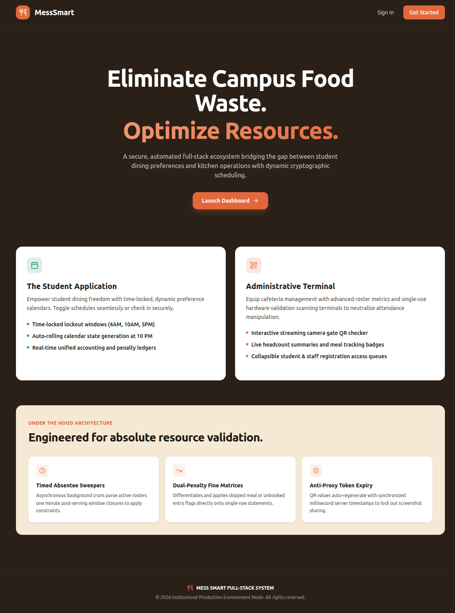
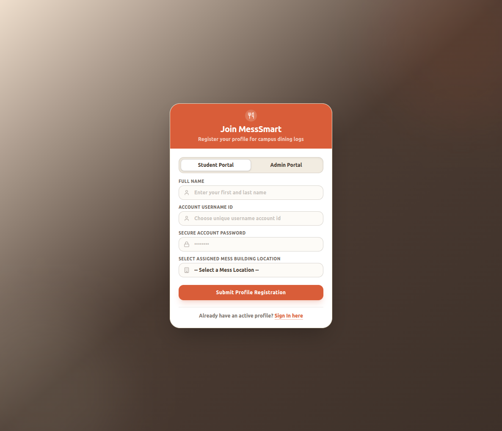
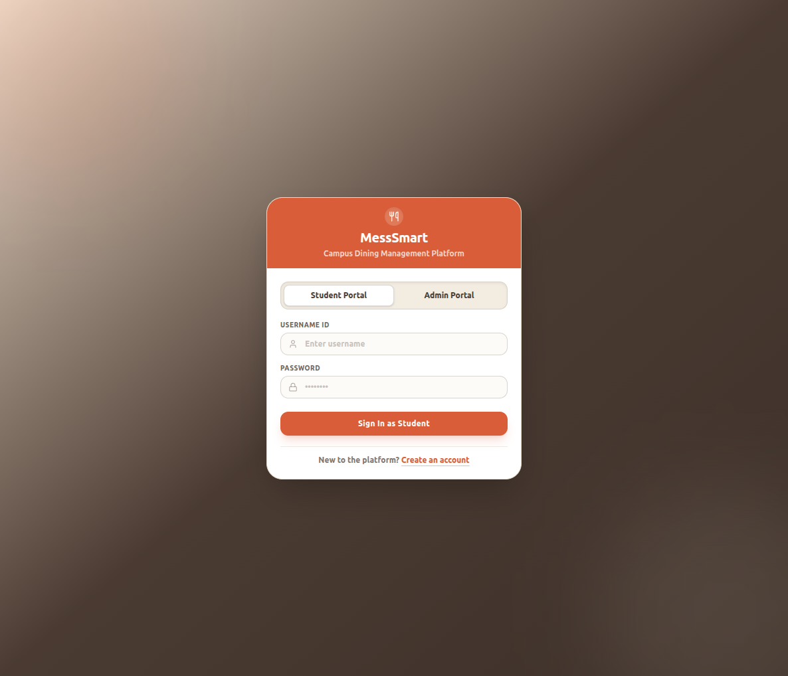
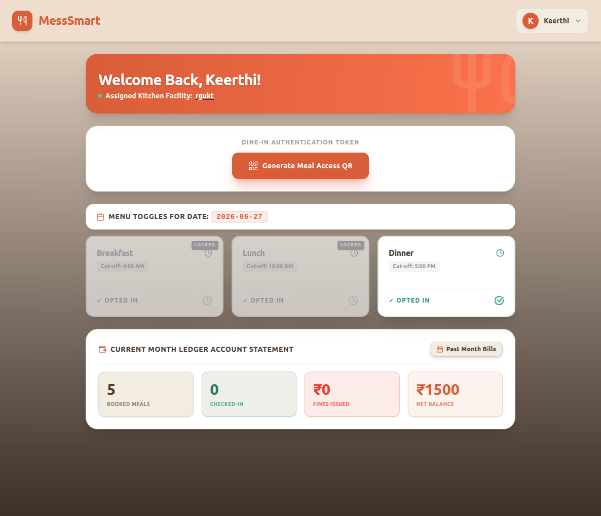
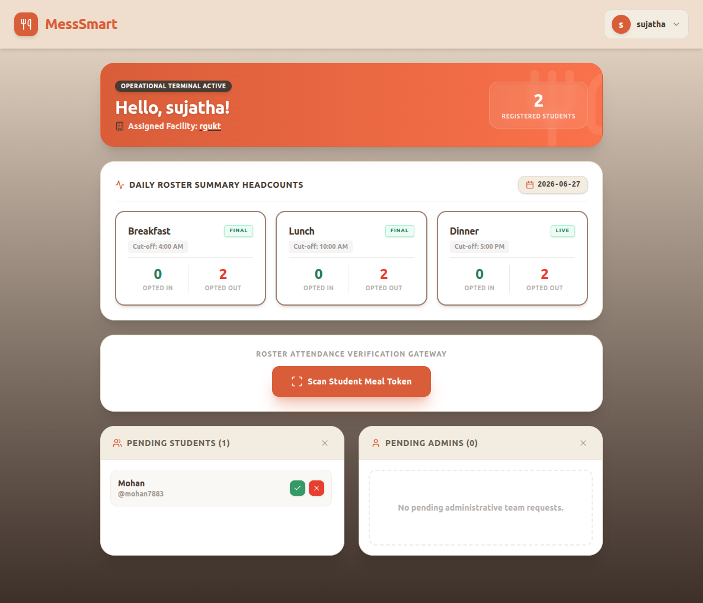
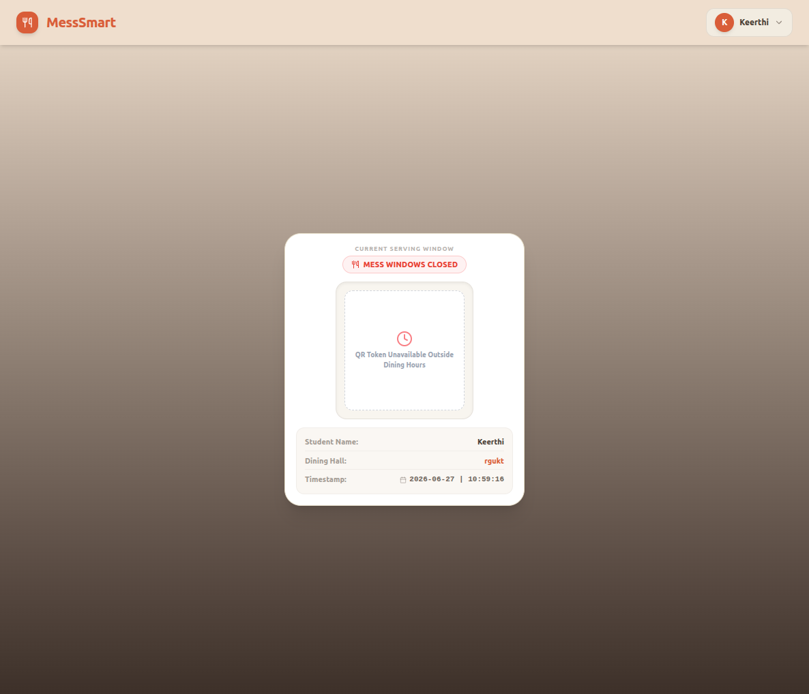
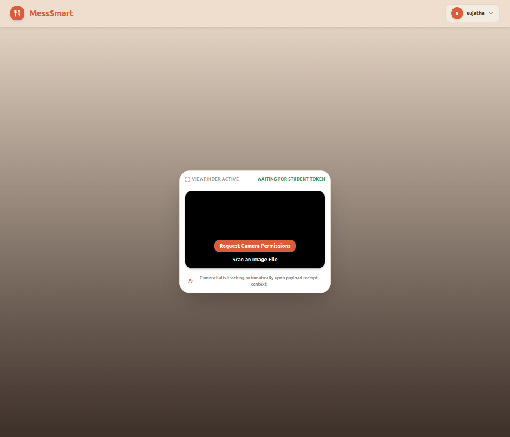

# 🍽️ MessSmart – Smart Hostel Mess Management System

> A full-stack web application that digitizes hostel mess operations through secure authentication, QR-based attendance, meal selection, automated billing, and multi-hostel management.

---

# 📖 Overview

Traditional hostel mess management is often handled manually, leading to:

* Manual attendance registers
* Meal wastage due to inaccurate counts
* Billing errors
* Lack of transparency
* Time-consuming administration
* Difficulty managing multiple hostels

**MessSmart** solves these problems by providing a centralized digital platform where students and administrators can manage hostel mess operations efficiently.

---

# 🚀 Features

## 🔐 Authentication & Security

* JWT Authentication
* Role-Based Access Control (Admin / Student)
* Protected API Endpoints
* Secure Login System

---

## 👨‍🎓 Student Module

Students can:

* Register into a hostel mess
* Login securely
* View Dashboard
* Generate QR Meal Token
* Select Meals (Breakfast/Lunch/Dinner)
* View Current Bill
* View Previous Bills

---

## 👨‍💼 Admin Module

Admins can:

* Login securely
* Scan Student QR Codes
* Record Meal Attendance
* Manage Hostel Mess


---

## 🏢 Multi-Hostel Support

MessSmart supports multiple hostel messes.

Each hostel maintains:

* Independent students
* Independent attendance
* Independent billing
* Independent administration

---

# 🧩 Problem Statement

Hostel messes commonly suffer from:

* Manual attendance tracking
* Duplicate meal entries
* Food wastage
* Billing inaccuracies
* Poor scalability
* No centralized management

MessSmart digitizes the complete workflow using QR-based verification and automated billing.

---

# 💡 Solution

MessSmart provides:

* Secure authentication
* QR-based attendance
* Meal preference selection
* Monthly automated billing
* Multi-hostel architecture
* Centralized administration

This significantly reduces manual work while improving transparency and operational efficiency.

---

# ⚙️ Technology Stack

## Backend

* Java
* Spring Boot
* Spring Security
* JWT Authentication
* Spring Data JPA
* Hibernate
* Maven

---

## Frontend

* React
* Vite
* React Router
* Axios
* HTML5
* CSS3
* JavaScript (ES6+)

---

## Database

* PostgreSQL

---

## Tools

* Git
* GitHub
* VS Code

---

# 🏗️ System Architecture

Student/Admin

↓

React Frontend

↓

REST APIs

↓

Spring Boot Backend

↓

JWT Authentication

↓

PostgreSQL Database

---

# 🔄 Application Workflow

### Student Flow

Register

↓

Login

↓

Select Meals

↓

Generate QR Token

↓

Admin Scans QR

↓

Attendance Recorded

↓

Monthly Bill Generated

---

### Admin Flow

Login

↓

Scan Student QR

↓

Attendance Stored

↓

View Attendance

↓

Generate Monthly Bills

↓

Manage Students


---

# 🛠️ Installation

## Clone Repository

```bash
git clone https://github.com/keerthi-bhemesetty-0406/MessSmart.git
```

---

## Backend Setup

```bash
cd messsmart-backend
```

Create:

```
application.properties
```

using

```
application-template.properties
```

Then run:

```bash
mvn spring-boot:run
```

---

## Frontend Setup

```bash
cd messsmart-frontend

npm install

npm run dev
```

---

## Database Setup

Create a PostgreSQL database.

Example:

```
mess_smart
```

Update:

```
application.properties
```

with your database credentials.

---

# 🔒 Security

MessSmart implements:

* JWT Authentication
* Role-Based Authorization
* Password Encryption
* Protected REST APIs

Sensitive configuration files are excluded from version control.

---

# 📸 Screenshots

## Landing Page



---
## Register



---

## Login



---

## Student Dashboard



---

## Admin Dashboard



---

## QR Meal Token



---

## QR Scanner



---

## Billing


---

# 🚀 Future Enhancements

* Email Notifications
* Mobile Application
* Online Payments
* Analytics Dashboard
* Meal Prediction
* AI-based Food Waste Analysis
* Hostel Reports

---

# 👨‍💻 Author

**Keerthi Bhemesetty**

B.Tech Computer Science

Full Stack Java Developer

---

⭐ If you found this project useful, consider giving it a star.
